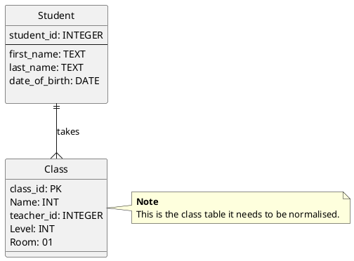

# ER Diagram

This is my diagram for my competittor app to KAMAR

```plantuml

@startuml
' config
hide circle


entity "Student" {
student_id: INTEGER
--
first_name: TEXT
last_name: TEXT
date_of_birth: DATE

}

entity "Class" {
class_id: PK
Name: INT
teacher_id: INTEGER
Level: INT
Room: 01
}

note right
<b>Note</b>
This is the class table it needs to be normalised.
end note

Student ||--{ Class : takes
@enduml
```